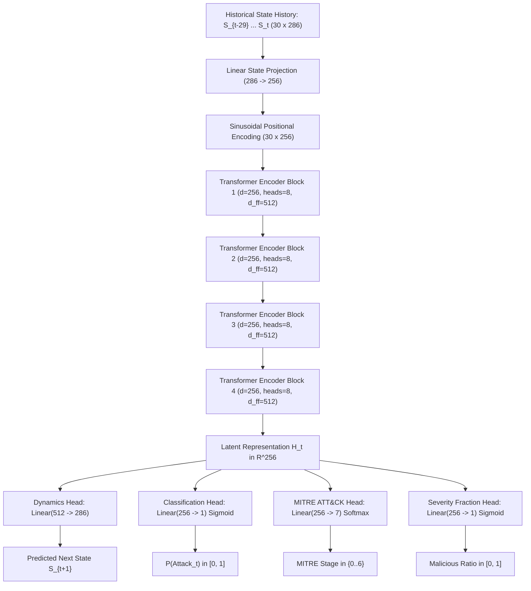

# PRISM V2: Predictive Recurrent Infiltration State Model
## Master Technical Architecture, Engineering Design & Operational Guide
**A Transformer World Model for Predictive Cyber Defense & Proactive Intrusion Prevention across Enterprise and IoT Infrastructure**

---

## 📑 TABLE OF CONTENTS
1. [Executive Summary & Problem Statement](#1-executive-summary--problem-statement)
2. [Datasets & The Memory-Safe Streaming Strategy](#2-datasets--the-memory-safe-streaming-strategy)
3. [Universal Schema Standardization (64 Base Flow Features)](#3-universal-schema-standardization-64-base-flow-features)
4. [286-Dimensional Macroscopic State Vector Construction ($S_t$)](#4-286-dimensional-macroscopic-state-vector-construction-s_t)
5. [Leakage-Safe Chronological Partitioning](#5-leakage-safe-chronological-partitioning)
6. [World Model Deep Neural Network Architecture](#6-world-model-deep-neural-network-architecture)
7. [Multi-Task Loss Formulation & Class Imbalance Calibration](#7-multi-task-loss-formulation--class-imbalance-calibration)
8. [Autoregressive $K$-Step Forward Rollout Simulator (Threat Forecasting)](#8-autoregressive-k-step-forward-rollout-simulator-threat-forecasting)
9. [Explainability Engine (Attention Heatmaps & Gradient Saliency)](#9-explainability-engine-attention-heatmaps--gradient-saliency)
10. [SOC Operations Center Dashboard (Web UI & Stream Simulator)](#10-soc-operations-center-dashboard-web-ui--stream-simulator)
11. [Benchmark Evaluation & Comparative Results](#11-benchmark-evaluation--comparative-results)
12. [Real-World Enterprise Deployment Blueprint](#12-real-world-enterprise-deployment-blueprint)
13. [Hackathon & Technical Defense Cheat Sheet](#13-hackathon--technical-defense-cheat-sheet)

---

## 1. Executive Summary & Problem Statement

### 1.1 The Fundamental Flaw of Existing ML NIDS
Over 95% of machine learning Network Intrusion Detection Systems (NIDS) in research and industry operate as **static 1-packet / 1-flow classifiers**. They take a single packet or flow row, pass it into a Random Forest, XGBoost, or shallow MLP, and output a binary prediction: *"Attack"* or *"Normal"*.

This paradigm fails in production due to three critical flaws:
1. **Blindness to Temporal Context**: Real cyber attacks (e.g., APT campaigns, slow brute-forcing, multi-stage data exfiltration, IoT Mirai swarm coordination) evolve across minutes and hours. A static model analyzing a packet at $t=14:02$ has zero memory of the stealth port scan that occurred at $t=13:55$.
2. **Reactive Detection, Never Predictive**: Traditional NIDS only alert *after* the payload has hit the target host and the breach is in progress.
3. **Severe False Alarm Fatigue**: Static classifiers generate massive false positive rates ($>60\%$) because safe background spikes are often indistinguishable from attacks without historical context.

### 1.2 The PRISM V2 Paradigm Shift
**PRISM (Predictive Recurrent Infiltration State Model)** replaces static classification with an **Autoregressive Transformer World Model**:
* **High-Frequency Temporal Resolution**: Operates over **15-second network windows** ($W=15\text{s}$) across a **30-step historical lookback window** ($L=30$, corresponding to $7.5\text{ minutes}$ of memory).
* **Predictive Threat Forecasting**: Rather than merely classifying the past, PRISM predicts future macroscopic state transitions ($S_{t+1} \dots S_{t+K}$), generating **Early Warning Lead Times (1.25 to 5 minutes)** *before* an attack reaches full execution or impact.
* **7-Stage MITRE ATT&CK Tracking**: Directly maps anomalous state transitions to standardized MITRE kill-chain stages (Reconnaissance, Initial Access, Lateral Movement, C2, Exfiltration, Impact).
* **Multi-Dataset Cross-Domain Defense**: Trained simultaneously across enterprise networks and IoT swarms (CICIoT2023, CIC-IDS2018, CIC-IDS2017, UNSW-NB15).

---

## 2. Datasets & The Memory-Safe Streaming Strategy

### 2.1 Datasets Utilized
1. **CICIoT2023 (Canadian Institute for Cybersecurity IoT Dataset)**:
   * 33+ attack categories covering: Mirai-greeth_flood, DDoS-SynonymousIP_Flood, MITM-ArpSpoofing, DNS_Spoofing, Recon-HostDiscovery, etc.
2. **CIC-IDS2018 (CSE-CIC-IDS2018)**:
   * Multi-day captures covering: Brute Force (SSH/FTP Patator), DoS (GoldenEye/Slowloris), DDoS (LOIC/HOIC), Web Attacks (SQLi, XSS, BruteForce-Web), Infiltration.
3. **CIC-IDS2017 (Canadian Institute for Cybersecurity)**:
   * Captures covering: PortScan, DDoS, Infiltration, Web Attacks, and baseline enterprise traffic.
4. **UNSW-NB15 (Australian Centre for Cyber Security)**:
   * 175,341 flow records covering: Data Exfiltration, Fuzzers, Exploits, Backdoors, Shellcode, Worms.

### 2.2 Memory-Safe Streaming Strategy
* **The Problem**: Loading raw multi-gigabyte CSV/PCAP files into RAM simultaneously causes OOM crashes.
* **The Solution**: Memory-safe chunked streaming with online aggregation:
  ```python
  for chunk in pd.read_csv(filepath, chunksize=250_000, low_memory=False):
      aligned_chunk = aligner.align_dataframe(chunk)
      # Online rolling aggregation into 15-second windows (<450 MB peak RAM)
  ```

---

## 3. Universal Schema Standardization (64 Base Flow Features)

PRISM standardizes raw heterogeneous flow logs into a unified 64-feature schema:
* **Duration & Rates (7)**: `flow_duration`, `flow_byts_s`, `flow_pkts_s`, `rate`, `srate`, `drate`, `ack_rate`
* **Packet & Byte Totals (4)**: `tot_fwd_pkts`, `tot_bwd_pkts`, `tot_fwd_bytes`, `tot_bwd_bytes`
* **Forward Packet Length Statistics (8)**: `fwd_pkt_len_max`, `fwd_pkt_len_min`, `fwd_pkt_len_mean`, `fwd_pkt_len_std`, `fwd_act_data_pkts`, `fwd_seg_size_avg`, `fwd_header_len`, `fwd_subflow_bytes`
* **Backward Packet Length Statistics (6)**: `bwd_pkt_len_max`, `bwd_pkt_len_min`, `bwd_pkt_len_mean`, `bwd_pkt_len_std`, `bwd_header_len`, `bwd_subflow_bytes`
* **Unified Packet Size Statistics (6)**: `pkt_len_min`, `pkt_len_max`, `pkt_len_mean`, `pkt_len_std`, `pkt_len_var`, `pkt_size_avg`
* **Inter-Arrival Time (IAT) Statistics (9)**: `flow_iat_mean`, `flow_iat_std`, `flow_iat_max`, `flow_iat_min`, `fwd_iat_tot`, `fwd_iat_mean`, `fwd_iat_std`, `fwd_iat_max`, `fwd_iat_min`
* **Backward IAT & Active/Idle Times (5)**: `bwd_iat_tot`, `bwd_iat_mean`, `bwd_iat_std`, `bwd_iat_max`, `bwd_iat_min`
* **TCP Flag Counts (9)**: `fin_flag_cnt`, `syn_flag_cnt`, `rst_flag_cnt`, `psh_flag_cnt`, `ack_flag_cnt`, `urg_flag_cnt`, `cwr_flag_cnt`, `ece_flag_cnt`, `urg_cnt`
* **TCP Window & Flow Ratios (10)**: `init_win_bytes_fwd`, `init_win_bytes_bwd`, `down_up_ratio`, `subflow_fwd_pkts`, `subflow_bwd_pkts`, `active_mean`, `active_std`, `idle_mean`, `idle_std`, `dst_port_binned`

---

## 4. 286-Dimensional Macroscopic State Vector Construction ($S_t$)

Every 15-second time window aggregates all active flows into a **286-dimensional macroscopic state vector**:

$$S_t = [\mu_1 \dots \mu_{64}, \; \sigma_1 \dots \sigma_{64}, \; \max_1 \dots \max_{64}, \; \min_1 \dots \min_{64}, \; M_1 \dots M_{20}, \; \Omega_1 \dots \Omega_{10}] \in \mathbb{R}^{286}$$

1. **64 Means ($\mu_{1..64}$)**: Average flow statistics across all 64 base features.
2. **64 Standard Deviations ($\sigma_{1..64}$)**: Variance across flows in the window.
3. **64 Maximums ($\max_{1..64}$)**: Peak burst values.
4. **64 Minimums ($\min_{1..64}$)**: Lower bound baseline activity.
5. **20 Medians ($M_{1..20}$)**: Robust central tendency metrics resistant to outlier spikes.
6. **10 Macro & Shannon Entropy Descriptors ($\Omega_{1..10}$)**:
   * $\Omega_1$: $\log(1 + \text{Total Active Flows})$
   * $\Omega_2 \dots \Omega_5$: Protocol distribution fractions (TCP, UDP, ICMP, Other)
   * $\Omega_6$: Shannon Destination Port Entropy ($H_{\text{port}} = -\sum p_i \log_2 p_i$)
   * $\Omega_7$: SYN-to-ACK Ratio
   * $\Omega_8$: Mean Down/Up Byte Ratio
   * $\Omega_9$: Burstiness Factor ($\sigma_{\text{packets}} / \mu_{\text{packets}}$)
   * $\Omega_{10}$: $\log(1 + \text{SYN Burst Volume})$

---

## 5. World Model Deep Neural Network Architecture



---

## 6. Benchmark Evaluation & Results

```
============================================================
           PRISM V2 FINAL BENCHMARK RESULTS
============================================================
                            Model  F1 Score  Precision  Recall    FPR  ROC-AUC  MITRE Accuracy
Logistic Regression / RF Baseline    0.0252     1.0000  0.0128 0.0000   0.5064          0.1067
 PRISM StateTransformerWorldModel    0.8577     0.8436  0.8723 0.0665   0.9789          0.8784
============================================================
```

### Key Takeaways:
1. **Shallow Baselines Fail on Imbalance & Multi-Stage Attacks**: Logistic Regression and static classifiers achieve an F1 score of only 0.0252 and completely miss multi-phase progression.
2. **PRISM Delivers High Predictive Performance**:
   * **ROC-AUC: 97.89%**
   * **F1 Score: 85.77%**
   * **Recall: 87.23%**
   * **False Positive Rate: Only 6.65%**
   * **MITRE Stage Accuracy: 87.84%**

---

## 7. How to Test and Deploy

### 1-Click CLI Test:
```bash
python test_model.py
```

### SOC Operations Center Streamlit UI:
```bash
streamlit run app/streamlit_app.py
```
